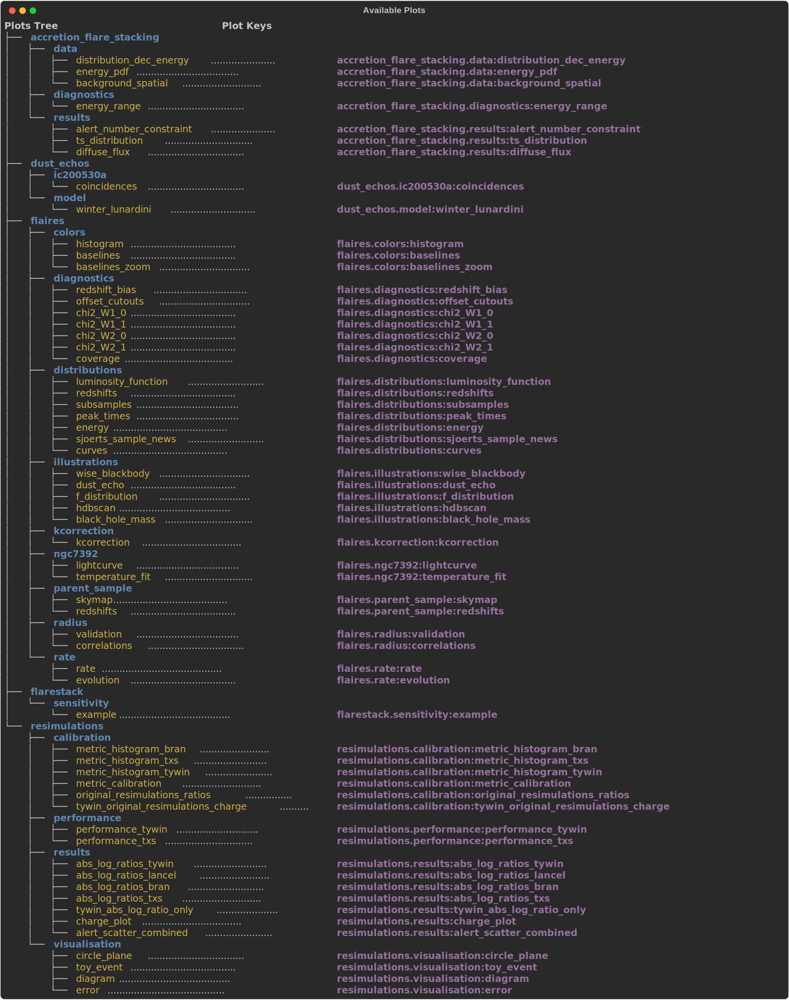

# Installation

Install via `poetry`:

```bash
poetry install
```

On an arm Mac, you likely have to install `healpy` via `conda`:

```bash 
conda install -c conda-forge healpy --no-deps
``` 

# Available Plot

This is a static version of the ouput of 
    
```bash
thesis-plots -L
```
